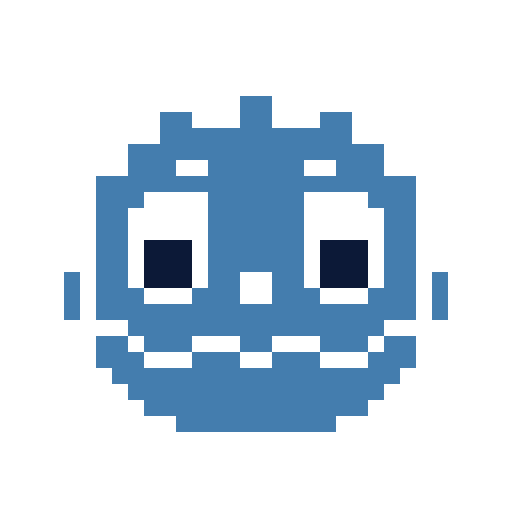
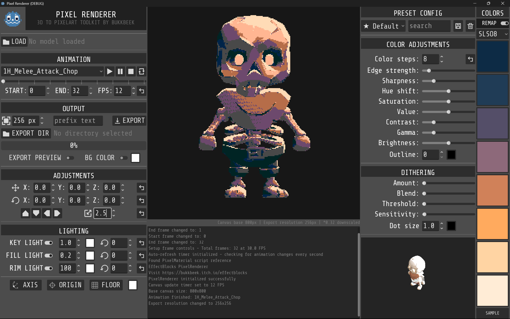

# Godot Pixel Renderer
### (Known as: Godot Pixel Studio)

<div align="center">
  
</div>

A powerful **3D to Pixel Art Renderer** built with Godot 4.4+ that transforms 3D models and animations into retro-style pixel art with customizable effects and frame by frame animation export capabilities.


[](https://youtu.be/uRmB3MXzR_Q?si=s-mqPHxdC0RcUgZr)

**Watch GFS - Games From Scratch review video on Youtube**

## 👨‍💻 Developer

Created by **[bukkbeek](https://bukkbeek.github.io/)** - an independent game developer passionate about pixel art and retro aesthetics.

[](https://bukkbeek.github.io/)
[](https://bukkbeek.itch.io/)

[](https://ko-fi.com/bukkbeek)

## 📥 Downloads
### 🎮 Get Pixel Renderer
[](https://github.com/bukkbeek/GodotPixelRenderer)
[](https://bukkbeek.itch.io/pixel-renderer)

- **🆓 [GitHub](https://github.com/bukkbeek/GodotPixelRenderer)**: Free and open source
- **💰 [Itch.io](https://bukkbeek.itch.io/pixel-renderer)**: Compiled version (support the developer!)

<div align="center">
  
</div>

## ✨ Features

### 🎨 Pixel Art Rendering
- **Real-time 3D to pixel art conversion** with customizable pixelation (8-800 pixels)
- **Color quantization** with adjustable steps (2-32 colors) and 8-color palette support
- **Advanced shader effects**: edge detection, sharpening, dithering, and outlines
- **Post-processing controls**: HSV adjustments, contrast, gamma, and brightness

### 🎬 Animation & Export
- **Frame-by-frame animation export** to PNG sequences with progress tracking
- **Flexible export settings**: custom frame ranges, variable FPS (1-120), resolution scaling
- **GLB/GLTF model support** with animation playback controls and auto-refresh detection
- **Camera system**: orthographic projection with positioning, rotation, and lighting controls

### 🎛️ User Experience
- **Intuitive interface** with organized control panels and real-time preview
- **Preset configurations** and console logging for detailed feedback
- **Export management** with custom paths, filename prefixes, and batch capabilities

<!-- Example Output GIFs -->
<div align="center" style="display: flex; gap: 16px; justify-content: center;">
  
  
</div>

## 🚀 Quick Start

### Requirements
- **Godot Engine 4.4+**
- **OpenGL 3.3+** compatible graphics card
- **4GB RAM** minimum (8GB recommended)

### Installation

1. **Clone and open:**
   ```bash
   git clone https://github.com/bukkbeek/GodotPixelRenderer.git
   cd GodotPixelRenderer
   ```

2. **Launch in Godot:**
   - Import `project.godot`
   - Press `F5` to run
   - Select `PixelRenderer/PixelRenderer.tscn` if prompted

## 📖 Usage

### Basic Workflow
1. **Load Model**: Click "Load Model" and select GLB/GLTF file
2. **Configure Effects**: Adjust pixelation, colors, and shader parameters
3. **Set Camera**: Position and frame your model using camera controls
4. **Export**: Choose output directory, set frame range/FPS, and export PNG sequence

### Key Controls
- **Animation**: Play/pause/stop buttons with loop toggle and frame range selection
- **Camera**: XYZ positioning, rotation presets, and zoom controls
- **Effects**: Pixelation slider, color steps, palette mode, and post-processing
- **Export**: Directory selection, resolution scaling, and filename customization

## ��️ Technical Details

### Core Architecture
- **`PixelRenderer.gd`**: Main controller and export system
- **`models_handler.gd`**: 3D model positioning and camera controls
- **`models_spawner.gd`**: Model loading and animation management
- **`pixel_material.gd`**: Shader parameter management
- **`PixelArt.gdshader`**: Custom pixel art rendering with Sobel edge detection and Bayer dithering

### Export System
Captures animation frames using SubViewport rendering with real-time pixel art effects, nearest-neighbor scaling, and PNG output with transparency support.

## 🤝 Contributing & Support

### Get Involved
- **⭐ Star** this repository
- **🐛 Report issues** on [GitHub Issues](https://github.com/bukkbeek/GodotPixelRenderer/issues)
- **💡 Submit** pull requests and feature suggestions


## 📄 License

This project is licensed under the MIT License.

## 🙏 Acknowledgments

Thanks to the **Godot Engine** community, **Lospec** pixel art community, and **KayKit** for the default skeleton asset.

Thanks to:
- Viktor Edén (github.com/HolyAcorn) for making the normal material and normal map export functionality

### 🤖 AI Development Assistance
This project was developed with the assistance of **Claude Sonnet** through **Cursor AI** as a coding assistant, helping to enhance development efficiency and code quality.
