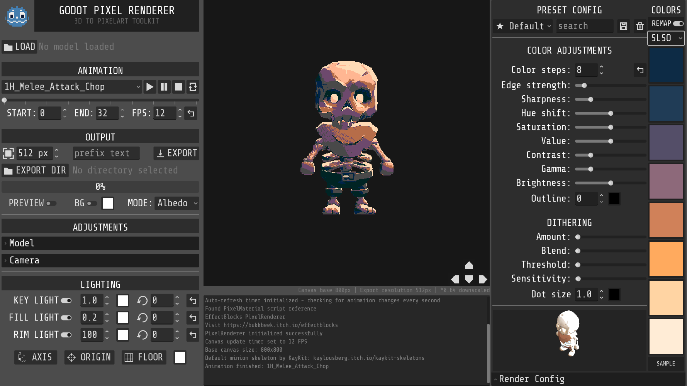

# Godot Pixel Renderer (Fork for Godot 4.5+)

<div align="center">
  
</div>

A **3D to Pixel Art Renderer** built for **Godot 4.5+**, transforming 3D models and animations into retro-style pixel art with customizable effects and frame-by-frame animation export. This fork uses Godot 4.5-specific nodes like `FoldableContainer` and improves usability with enhanced model and camera controls.


## ⚠️ About This Fork

* Updated for **Godot 4.5+** (still in beta), leveraging new nodes and features unavailable in Godot 4.4.
* **Not merged** with the original repository to avoid conflicts with the main project while the engine version is in beta.
* Original project: [bukkbeek / GodotPixelRenderer](https://github.com/bukkbeek/GodotPixelRenderer)

## 👨‍💻 Developer

This fork is maintained independently to provide updated features for Godot 4.5+ users.

## 📥 Downloads

* **🆓 [GitHub Repository](https://github.com/uxerror/RetroForge)**: Free and open source

<div align="center">
  
</div>

## ✨ Features

### 🎨 Pixel Art Rendering

* Real-time 3D to pixel art conversion (8–800 pixels)
* Color quantization with adjustable steps and palette support
* Shader effects: edge detection, sharpening, dithering, outlines
* Post-processing controls: HSV, contrast, gamma, brightness

### 🎬 Animation & Export

* Frame-by-frame animation export to PNG sequences
* Custom frame ranges, variable FPS, resolution scaling
* GLB/GLTF/FBX model support with animation playback
* Import texture
* Orthographic camera with positioning, rotation, and **preset views**
* **Checkpoint system**:

  * Save and restore camera + model positions
  * Each checkpoint automatically generates a button in the UI for quick access
  * Export runs through all checkpoints, producing sequences for each (e.g. `frame_cp01_0001.png`)

### 🎛️ User Experience Improvements

* **Model & camera control enhancements:** manipulate position and rotation with step values
* **Camera presets:** quickly switch between common views (isometric, top-down, etc.)
* **UI adjustments:** model control buttons moved to the rendering viewport for intuitive interaction
* **Flexible panels:** right-hand render settings can now be hidden; drop-down menus for key settings added
* **Simplified and refactored code** for easier maintenance and better defaults
* **Checkpoint buttons** appear automatically and let you instantly switch saved states

## 🚀 Quick Start

### Requirements

* **Godot Engine 4.5+ (beta)**
* OpenGL 3.3+ compatible GPU
* 4GB RAM minimum (8GB recommended)

### Installation

1. Clone the repository:

   ```bash
   git clone https://github.com/uxerror/RetroForge.git
   cd RetroForge
   ```
2. Open the project in Godot 4.5+
3. Run `RetroForge/PixelRenderer.tscn`

### Usage

1. **Load Model**: Select a GLB/GLTF/FBX file
2. **Adjust Effects**: Pixelation, colors, shaders
3. **Set Camera**: Position, rotation, and choose a preset view
4. **Save Checkpoint(s)**: Store model/camera states.
5. **Export**: All checkpoints are exported sequentially with unique filenames

## 📄 License

MIT License

## 📋 Changelog

### v1.3 (Fork for Godot 4.5+)

* Added **checkpoint system** for saving/restoring camera + model states
* Automatic UI buttons for each checkpoint
* Export now supports multiple checkpoints with unique file naming
* Refactored export logic for clarity and maintainability
* Enhanced model and camera controls with step values
* Added camera presets
* UI improvements: movable model controls and hideable render panel
* Refactored code for better defaults and maintainability
* Compatible with Godot 4.5+ using `FoldableContainer`
